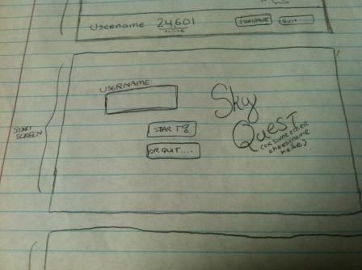
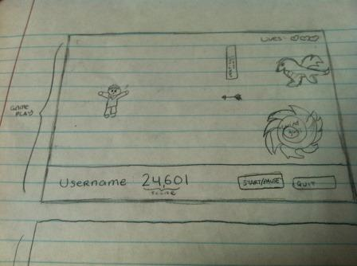
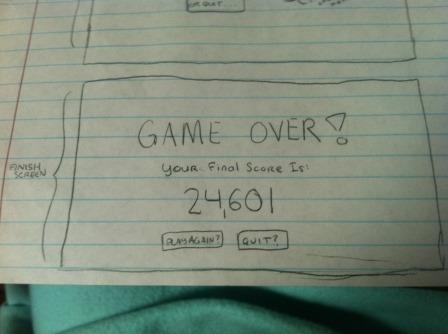

#Game Design Document for PA5 & PA6

## Purpose/Overview

The purpose of these programming assignments is to make a game using QT. The game must including moving objects and will be implemented using timers, GUI input classes, and QT widgets.

## Requirements

* Must have at least 5 different items in the game, 4 of which must be moving.
* Items must be represented by different classes, and must be stored in a templated data structure, STL container, or QT container.
* New items show up randomly at different times and intervals.
* Users can start, pause, and quit the game.
* Users have a username, a score displayed, and a finite amount of lives.
* Game should speed up as time elapses until its too hard for a human to play.

## Five Moving Items / Classes
Tentative classes. More functions may be added.

### `Item`
Abstract base class that all of the game items inherits from.

#### Data Members

`int x_`

X coordinate of the item relative to the game screen.

`int y_`

Y coordinate of the item relative to the game screen.

`int vx_`

Velocity of the x coordinate. Item will move this many pixels each time `move()` is called.

`int vy_`

Velocity of the y coordinate. Item will move this many pixels each time `move()` is called.

`QPixMap* pic_`

QPixMap for the graphic of the item. 

#### Member Methods

`Item(int x, int y, int vx, int vy, QPixMap* pic)`
Default constructor.

`virtual move()`
Virtual move function. Changes the item position. **Note:** Because of Qt's axis, moving "up" the screen is actually a negative velocity value, while moving down is a positive value. The same applies to the x-direction velocity. Moving to the left (which is "positive" for this game) is actually a negative velocity value for Qt. 

### Item One: `Platform`
Inherits from `Item`. One of the obstacles. Vertical wall that moves up and down a portion of the screen at a constant rate. Does not move horizontally except at the constant speed the level.

Data members are inherited from `Item`.

#### Member Methods

`Platform(int y, int vx, int vy, QPixMap* pic)` Default constructor. Initial `x_` is always the right edge of the screen. `vx_` will be the speed of the current level. (See **Gameplay**.)

`move()` Changes the item position. The range of the platform is set to a fourth of the screen (tentatively). When `Platform` reaches the top or bottom edge of this boundary, it starts moving in the opposite direction.

### Item Two: `Arrow`
Inherits from `Item`. One of the obstacles. Moves horizontally at a rate faster than the level speed. Vertical position is randomized and does not change.

Data members are inherited from `Item`.

#### Member Methods

`Arrow(int y, int vx, QPixMap* pic)` Default constructor. Initial `x_` is always the right edge of the screen. `vy_` is 0.

`move()` Changes the item position.

### Item Three: `Wind`
Inherits from `Item`. One of the obstacles. Does not move vertically and moves horizontally at the constant level speed. It does however move in a stationary clockwise fashion. Covers a larger area than the other obstacles.

Data members are inherited from `Item`.

**No image for wind yet.**

#### Member Methods

`Wind(int y, int vx, QPixMap* pic)` Default constructor. Initial `x_` is always the right edge of the screen. `vy_` is 0. `vx_` moves at the same speed as the screen. The clockwise motion will be made by editing `pic` of the wind, rather than actually moving `Wind`.

`move()` Changes the item position.

### Item Four: `Dragon`
Inherits from `Item`. One of the obstacles. `Dragon` is as `Wind` and also moves horizontally at the level speed. However, contact with a `Dragon` will end the game even if you have multiple lives left.

**No image for dragon yet. Will be a pixel dragon.**

Data members are inherited from `Item`.

#### Member Methods

`Dragon(int y, int vx, QPixMap* pic)` Default constructor. Initial `x_` is always the right edge of the screen. `vy_` is 0. `vx_` moves at the same speed as the screen. 

`move()` Changes the item position.

**Note:** I may (potentially) get rid of `Wind` and instead add a fireball element to the dragon that moves at the same speed as `Arrow` but also kills you right away, but I'm not sure. I probably will not, though.

### Item Five: `Gem`
Inherits from `Item`. Bonus item in the game. Appears sporadically and moves in straight line at a faster speed than the level speed.

Data members are inherited from `Item`.

#### Member Methods

`Gem(int y, int vx, QPixMap* pic)` Default constructor. Initial `x_` is always the right edge of the screen. `vy_` is 0. `vx_` moves at the level speed.

`move()` Changes the item position.

### `Player`
Inherited from `Item`. Player is the user's avatar. 

**No image for player yet. Will be a person.**

#### Data Members
Data members are inherited from `Item`.

`int lives_` Number of lives the user has. Initialized to 3 and decreased by 1 each time the player hits an obstacle.

#### Member Methods

`Player()` Default constructor. Initial position is always set to a fixed value. `vx_` is always 0. `vy_` is initialized to a constant speed to fall down the screen.

`move()` Changes the player's position. If mouse is clicked, player moves up the screen. Otherwise it moves down.

## Gameplay
This game is a side-scrolling game similar to the well-known helicopter game on the internet. The goal is to stay alive as long as possible by avoiding obstacles and the screen boundaries.

The player's avatar start automatically falling down the screen at a constant rate (the x-position does not change). Once the mouse button is left-clicked, however, the avatar starts to ascend, also at a constant rate. The mouse must be held down to continuously rise. As soon as it's released, the player starts to fall again.

Obstacles travel across the screen from left to right. Some move vertically up and down, while others stay stationary. They include moving platforms, arrows, wind gusts, and dragons. The top and bottom of the screen also count as boundaries. If the player comes into contact with any of these items, they lose a life.

### Levels
There are 5 levels that each last about 30 seconds (tentatively). Obstacles start moving faster and appear at a more frequent rate the higher the level. Dragons only start appearing on level 3.

### Scoring
A user's score is equivalent to the "distance" they've traveled, aka how long they've stayed in the game. Gems are worth 20 bonus points. The score keeps incrementing as long as the game lasts and cannot be decreased.

### Lives
The user has 3 lives. There are no ways to gain additional lives. The game ends when a player has no more lives. As mentioned earlier, each obstacle hit loses a life. The avatar will flash to signify this. The score will not restart each time a user loses a life. `Player` has an `int lives_` member that will keep track of how many lives a user has. When `lives_` == 0, the game ends.

## Layout
There will be a start screen, a gameplay screen, and a finished screen.

### Start Screen
Includes the game name, a text box to enter a user name, a start button, and a quit button. If the user does not enter a username, it defaults to 'User'. The quit button closes the program, and the start button will begin the game and switch the scene to the gameplay screen.

### Gameplay Screen
New items will enter the screen from the right side and exit at the left. The player's avatar stays stationary on the left side, moving only in the vertical direction. The level and lives are displayed in the top right corner. A toolbar at the bottom of the gameplay window shows the user's name and score. It also contains two buttons to pause/restart the game and to quit the game.

### Finish Screen
Once the player loses all three lives, the game switches to the finish screen. The screen shows the player's final score and has two buttons, one to start a new game and one to quit.

