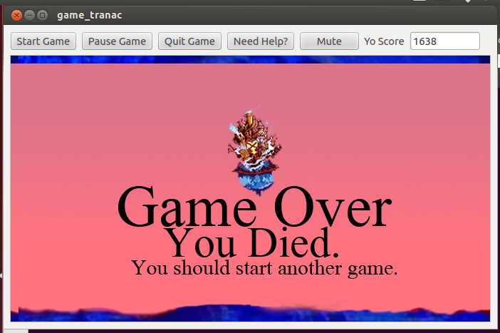

#Game Design Document for PA5 & PA6

## Purpose/Overview

The purpose of these programming assignments is to make a game using QT. The game must including moving objects and will be implemented using timers, GUI input classes, and QT widgets.

## Requirements

* Must have at least 5 different items in the game, 4 of which must be moving.
* Items must be represented by different classes, and must be stored in a templated data structure, STL container, or QT container.
* New items show up randomly at different times and intervals.
* Users can start, pause, and quit the game.
* Users have a username, a score displayed, and a finite amount of lives.
* Game should speed up as time elapses until its too hard for a human to play.

## Player, Moving Items, Et Cetera.
All five moving items inherit from an abstract `Item` class that contains a virtual `move()` function, a `collide()` and various data members. All `Item`s are held in a `QVector<Item*>`. The player **is not** part of this vector.

### Player

`Player` is the player. It stays stationary in the x-direction, but constantly moves in the y-direciton. If the mousebutton is pressed, it will move upwards. Otherwise it will fall.

### Item One: Red Nocturne

`RedNocturne`s are the basic enemies. They are spawned randomly and simply move horizontally across the screen at a faster pace than the game speed. Contact with a `RedNocturne` loses the player a life. Initial y-position is random.

### Item Two: Aquatank

`Aquatank`s are enemies. They behave in the same fashion as `RedNocturne`s except that contact with an `Aquatank` will end the entire game regardless of the number of lives you have left. Initial y-position is random.

### Item Three: Air Soldier

`AirSoldier`s are enemies. They travel in a straight line for the first half of its path, and then dive bomb and travel in a diagonal path downwards. Contact with an `AirSoldier` loses the player a life. Initial y-position is always at the top of the screen.

### Item Four: Tornado Step

`TornadoStep`s are bonus itmes. They spawn rarely, and colliding with a `TornadoStep` gives the user 100 bonus points. They travel not only horizontally across the screen, but also vertically over a set portion of the screen. Intial y-position is random.

### Item Five: White Mushroom

`WhiteMushroom`s are bonus items. They spawn rarely, and colliding with a `WhiteMushroom` gives the user an extra life. For the first half of the screen, the `WhiteMushroom` will teleport 50 pixels up or 50 pixels down from its current position if it has the same y-coordinate as the player. Otherwise, it will travel in a straight horizontal line. It will stop teleporting once it gets halfway across the screen. Intial y-position is random.

### Item Six: Gargoyle

`Gargoyle`s are enemies. While `WhiteMushroom`s avoid the user's position, the `Gargoyle` will mimic it for the first third of the screen. Once it reaches that one-third point, it will travel in a straight horizontal line. Contact with a `Gargoyle` loses the player a life. Intial y-position is the `Player`'s y-coordinate at the time.

### Nonmoving Items

I also have several non-moving items. There is a `Life` item that is simply displayed for each life the user has left. `Life`s are held in a vector. There is also a `Message` item that has two `Pixmap`s in it: one for the start screen and one for the game over screen. `Message` is hidden during gameplay.

## Gameplay
This game is a side-scrolling game similar to the well-known helicopter game on the internet, but with a Kingdom Hearts twist. The goal is to stay alive as long as possible by avoiding obstacles and the screen boundaries.

The player will start automatically falling down the screen at a constant rate (the x-position does not change). Once the mouse button is left-clicked, however, the avatar starts to ascend, also at a constant rate. The mouse must be held down to continuously rise. As soon as it's released, the player starts to fall again.

### Obstacles
There are 3 types of enemies: `RedNocturne`s, `AirSoldier`s, `Gargoyle`s, and `Aquatank`s. Contact with the first three all lose the player a life while contact with an `Aquatank` ends the game.

### Levels
There are no specific levels to the game. However, at set intervals, the game speed starts to speed up (both the player and the enemies/items).

### Scoring
A user's score is equivalent to the "distance" they've traveled, aka how long they've stayed in the game. `TornadoStep`s are worth 100 bonus points. The score keeps incrementing as long as the game lasts and cannot be decreased.

### Lives
The user has 3 lives. `WhiteMushroom`s are the only way to gain an extra life. The game ends when a player has no more lives. As mentioned earlier, each obstacle hit loses a life. Contact with the upper and lower screen boundaries will also result in a lost life. `Aquatank`s will end the game despite the number of lives left. `Player` will flash to indicate a lost life. The score will not be reset each time a user loses a life. The `MainWindow` class has an `int lives_` member that will keep track of how many lives a user has. If `lives_` == 0, the game ends.

### User Control
There is a menubar above the game window. (See **Layout: Game Screen**.) Pressing the `Pause` button will pause the game timer and game. A user will be able to enter their name before they begin a new name on the start screen. (see **Layout: Start Screen**).

### Invincible Mode
The user may select an invincible mode at the beginning of the game. In this mode, the player cannot die. The only way for the game to end is for the user to manually quit. This is selected by a radio button in the toolbar. No items have any effect in invincible mode, including bonus items.

## Layout
There will be a start screen, a gameplay screen, and a finished screen.

### Start Screen
The main screen includes the game name, a text box to enter a user name. A user **must** enter a name to start gameplay. A toolbar above also holds a start button, a pause button, and a quit button. The quit button will close the program. The start button will begin a new game and switch to the gameplay scree barring a user name input. The pause button currently does nothing. The toolbar also holds a radio button that the user may select if they want to play in invincible mode.

### Gameplay Screen
The gameplay screen is similar to the start scren, but there is a scrolling background and added items. Added to the toolbar is the user's name displayed with their score. At the top left of the gameplay scene, three keyblades are shown to indicate the number of lives left. These increase and decrease as the user's lives increase and decrease.

Items enter the scene from the right and exit from the left. `Player` starts at a fixed x-coordinate but moves up and down. The `Pause` button now has functionality; it will stop the game timer if it's running. Clicking on it again will start it again with the same game. `Start` now restarts the entire game from the begninning.

### Finish Screen
Once the player loses all three lives or hits an `Aquatank`, the game switches to the finish screen. It is very similar to the start screen, as it displays an image. All previous items in the scene (`Player`, `Item`s, et cetera) are removed from the scene and deleted. From here, the user can start a new game using `Start` or quit the program.

## Sources
All pixel images are from this site: http://spriters-resource.com/gameboy_advance/khcom/

The inital background is taken and edited from: http://www.khinsider.com/gallery/details.php?image_id=3237
