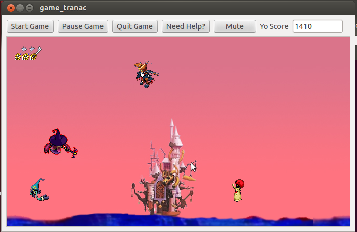

# Game - Programming Assignments Private Repository
### Student Information
  + Name: Angelica Huyen Tran
  + USC Email: tranac@usc.edu
  + USC ID: 5286316282

### Game Information
  + Game Name: Flying Bastion
  + Game Description: Avoid obstacles and stay alive as long as possible in this side-scrolling flying game.
  + [Game Design Doc](GameDesignDoc.md)


### Compile & Run Instructions
The grader should use the following procedure to compile and run the code:
```shell
#QtMultimedia must first be installed
sudo apt-get install qt-mobility-dev

#Compile Instructions; .pro file already included in the repo
qmake
make

#Doxygen Instructions
doxygen -g config.txt
doxygen config.txt

#Command to run
./game_tranac
```

### Screenshots
